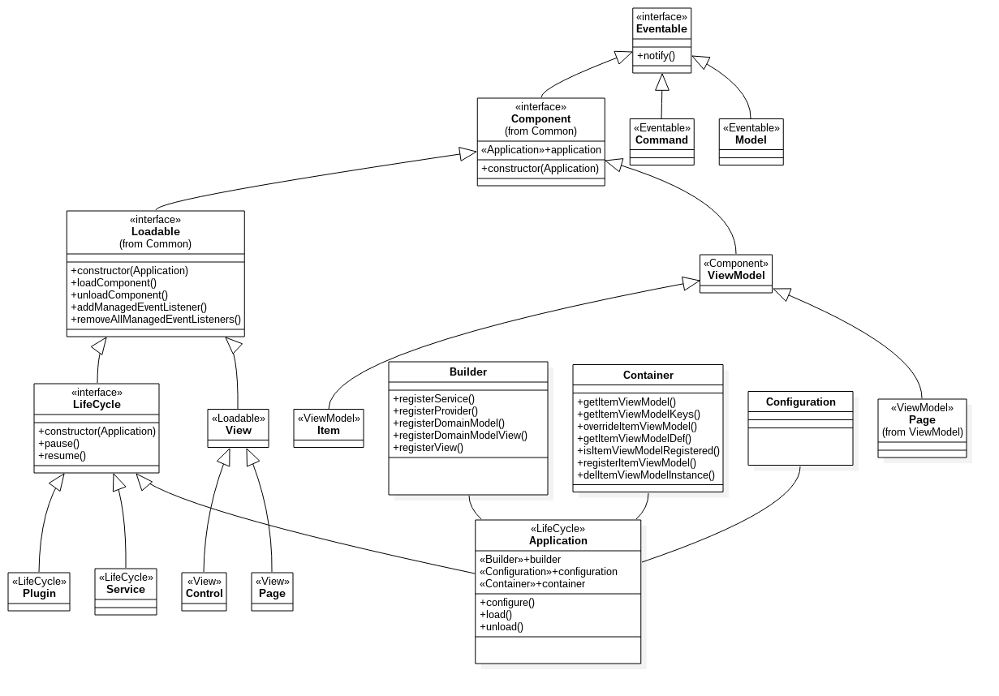

Technical Documentation
=====

- [Architecture](#architecture)
- [Application](#application)

----
#Architecture

#Application

Methods:
  
  - `constructor(config)`
  - `configure(config, callback)`
  - `load(config, callback)`
  - `unload(config,callback)`

Properties:
